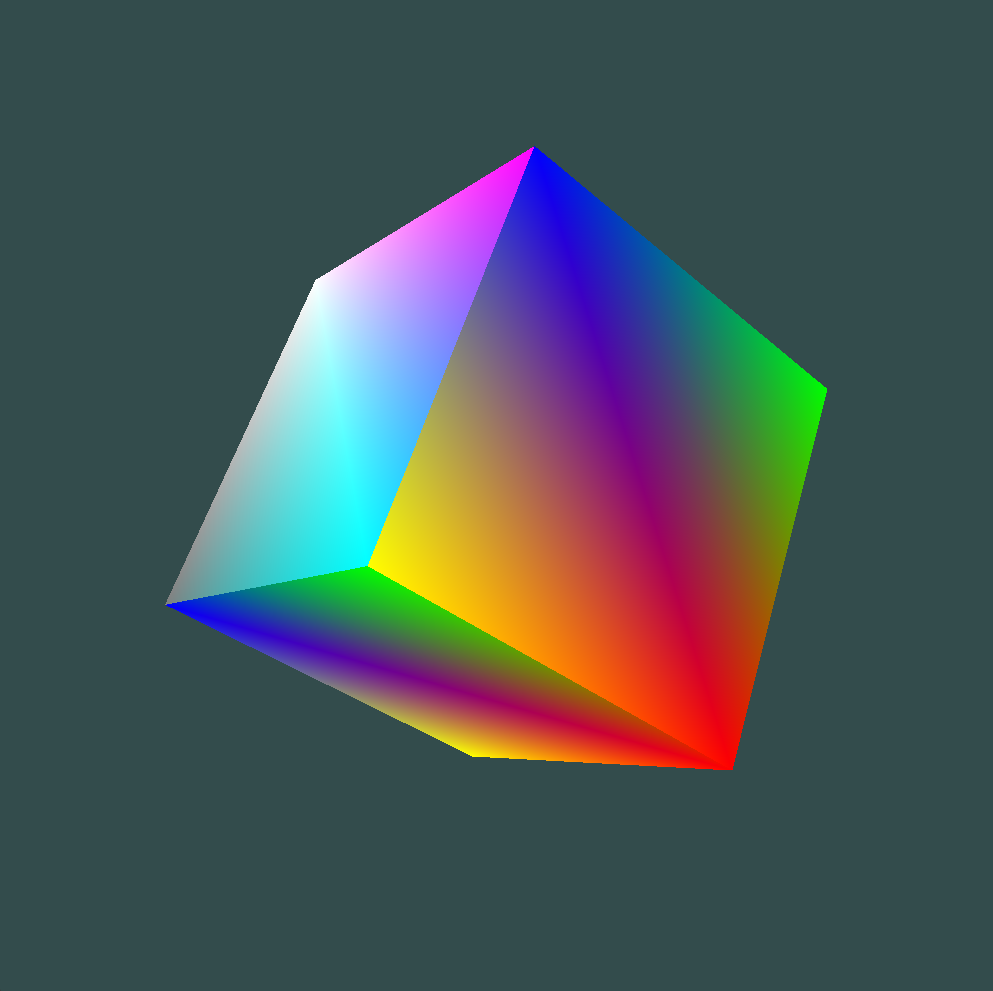
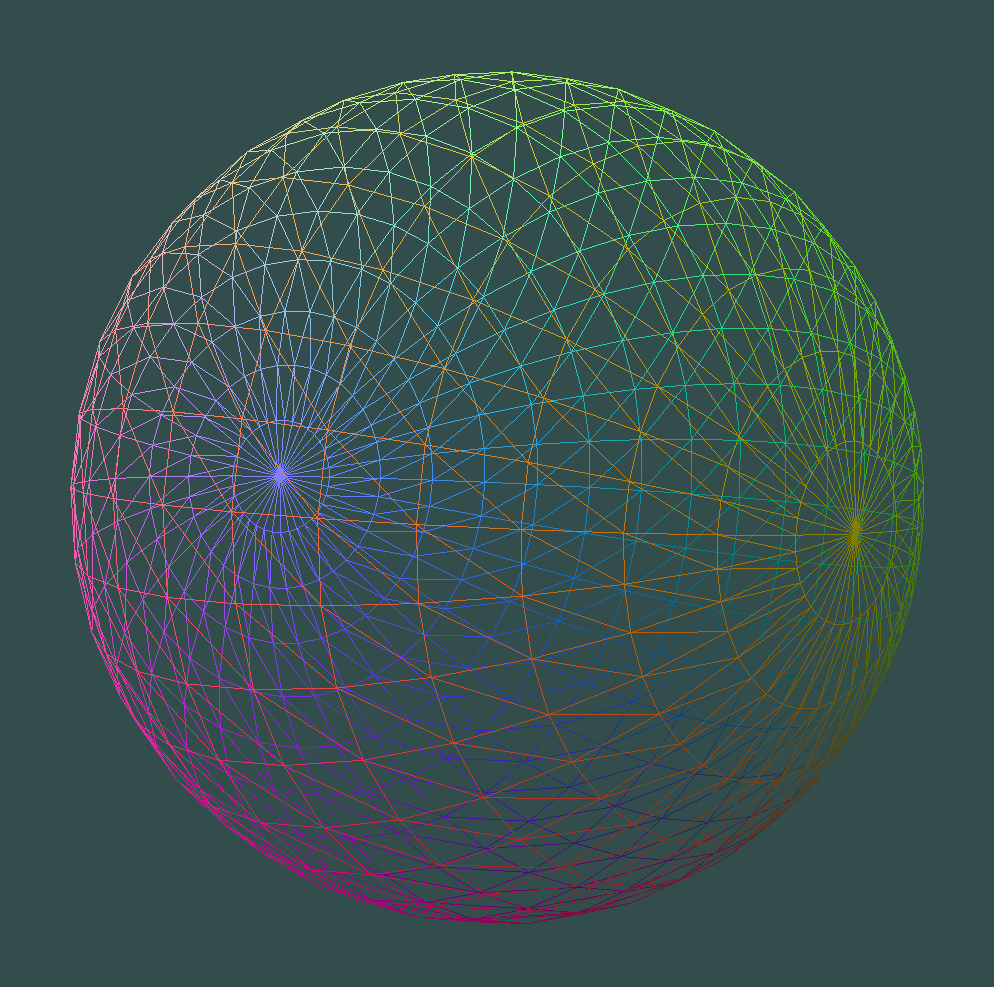
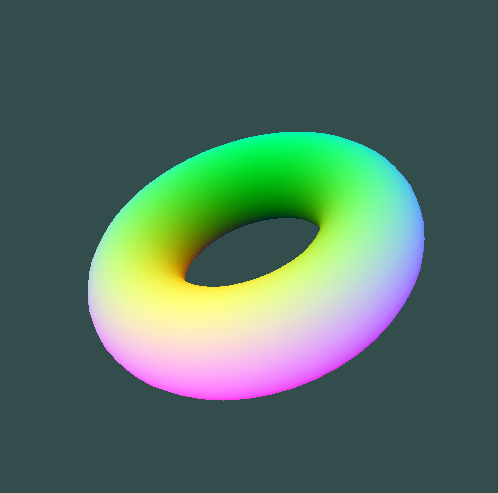

# OpenGL Project Setup


[comment]: <> (Source: https://ileriayo.github.io/markdown-badges/)

## Overview


> "All these codes, just to render a cube? - Yes"


This is a CMake project setup for common OpenGL libraries, which includes GLFW, GLAD, GLEW, GLM, and FreeGLUT. The project also rendered some common computer Graphics Objects such as triangles, sphere, or cubes.

Minimum Requirements: 
1. C++17
2. C17
3. [CMake](https://cmake.org/) 3.10

## Installations

1. [GLFW](https://www.glfw.org/download). There are two options: build from source using CMake or use prebuilt binaries.
2. [GLAD](https://glad.dav1d.de/). Select API > gl > Latest Version. The API version doesn't matter, as long as it is greater than the GLFW version you're using. After that, go to Profile > Core, then press "Generate" and download the zip folder.
3. [GLEW](https://glew.sourceforge.net/index.html). You can download the .zip folder directly and use it.
4. [GLM](https://github.com/g-truc/glm/tags). This is a header-only library, so linking is very straightforward.
5. FreeGLUT. There are two options, you can either install from [source](https://sourceforge.net/projects/freeglut/), or use [FreeGLUT MSVC](https://www.transmissionzero.co.uk/software/freeglut-devel/) specification as I did.

## Build

Create a `build` directory

```bash
mkdir build
cd build
```

**Configure**, **build**, and **run** the project with **release** (recommended)

```bash
cmake --build ./build/ --config Release
./build/Release/{file-name}
```

or with **debug**:

```bash
cmake --build ./build/ --config Debug
./build/Debug/{file-name}
```

Same thing for window, but remember to change to backward slash `\` and run with .exe instead.

## Demo

Rotating Cube Rendering:

<p align="center">

</p>

Rotating Sphere Rendering:

<p align="center">

</p>

Rotating Donut Rendering:

<p align="center">

</p>

## Note:

I will add more libraries and write better cmake scripts in the future.

